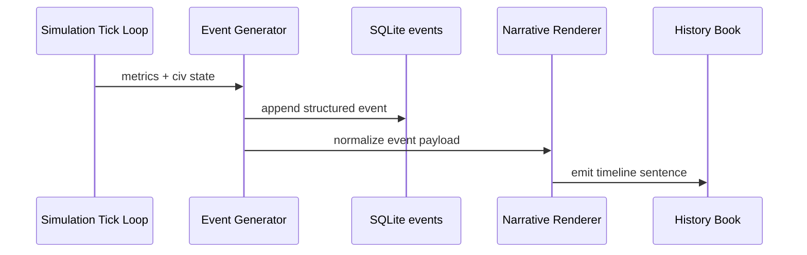

# Living History Engine

The proposed flagship system for EvoCivilization is an AI-powered history layer that turns raw simulation events into readable historical narratives.

## Why It Matters

Most simulation games keep event data as internal logs. EvoCivilization can differentiate itself by converting emergent simulation data into a coherent narrative timeline that players can read, replay, and share.

## Core Components

### 1) Event Logger
Captures high-value events in structured form.

Event categories:
- Civilization founding/splits/collapse
- Wars, treaties, and alliances
- Technology milestones
- Migration waves
- Environmental disasters
- Economic booms/crises

Example event:

```json
{
  "year": 420,
  "eventType": "CivilizationFounded",
  "civilization": "Aralon",
  "location": "Northern Plains",
  "population": 1200
}
```

### 2) History Database
Store events in SQLite/PostgreSQL with append-only event records.

Candidate tables:
- `events`
- `civilizations`
- `leaders`
- `wars`
- `technologies`

### 3) Narrative Generator
Transforms structured events into natural-language historical entries.

Example transform prompt:

```text
Convert this event into a historical record.
Event: War between Aralon and Lythia
Year: 512
Outcome: Aralon victory
```

Example output:

> In 512, the armies of Aralon defeated Lythia after a short but decisive campaign, securing trade access to the western corridor.

### 4) Documentary Mode UI
Player-facing timeline experience:
- Chronological event feed
- Playback/rewind by year
- Map overlays (borders, migration, trade)
- Civilization rise-and-fall summaries

## MVP Scope

1. Define canonical event schema.
2. Build append-only event writer in simulation loop.
3. Render timeline UI from database records.
4. Add templated narrative generation (non-LLM fallback).
5. Enable snapshot export (“History Book” markdown/PDF).

## Stretch Goals

- Voice narration for replay mode.
- Multiple historical perspectives (“Aralon chronicler” vs “Lythian archive”).
- Shareable world-history artifacts for community content.

## Example Timeline

```text
Year 112: The Kingdom of Lythia unites three tribes.
Year 340: Trade routes emerge between Lythia and Aralon.
Year 511: The First Continental War begins.
```

---

## Current Implementation Snapshot

This repository now includes an implemented MVP scaffold for the Living History Engine:

- `simulation/history.py` provides event generation from simulation metrics.
- SQLite event storage via `write_history_db`.
- Templated narrative text generation via `render_narrative`.
- Markdown timeline export via `write_history_book`.
- CLI integration via `run_phase1.py --history`.

This is a deterministic template-based narrative baseline intended to be upgraded later with richer prompt-driven generation.


## Timeline Pictorial


